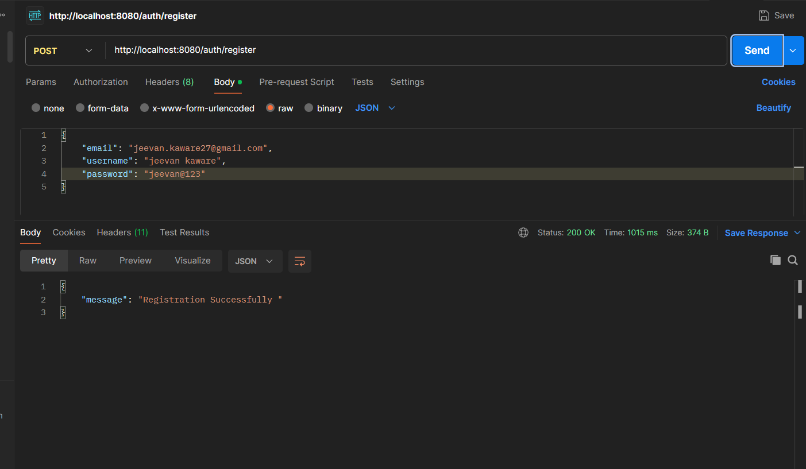
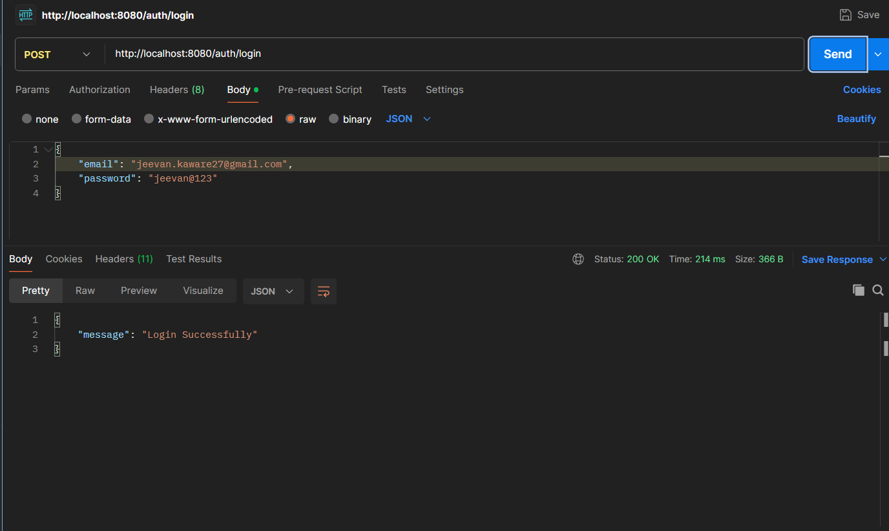
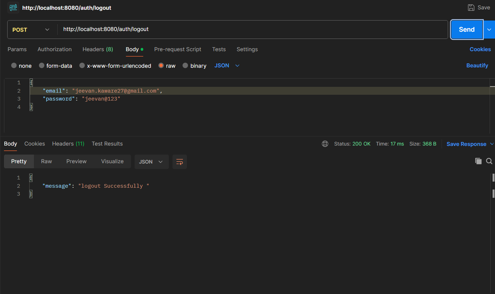

# 🚀 JWT Authentication API

<div align="center">

# 🔐 JWT Authentication API

### Secure User Authentication REST API built with Spring Boot & Spring Security

<p align="center">


</p>

</div>

---

# 📖 Overview

JWT Authentication API is a production-ready **Authentication REST API** developed using **Spring Boot** and **Spring Security**.

The application demonstrates secure user authentication using **JSON Web Tokens (JWT)** and follows modern backend development practices with a clean layered architecture.

Users can securely register, log in, and log out while passwords are encrypted using **BCrypt Password Encoder**.

The project is designed as a backend-first authentication service that can easily be integrated with any frontend application such as **React, Angular, Vue, Android, or Flutter**.

---

# ✨ Features

## 🔐 Authentication

- User Registration
- Secure Login
- JWT Authentication
- User Logout
- BCrypt Password Encryption
- Request Validation
- Stateless Authentication

---

## 👤 User Management

- Register New User
- Login Existing User
- Secure User Authentication
- JSON Request & Response Handling

---

## 🔒 Security

- Spring Security
- JWT Authentication
- BCrypt Password Encoder
- Protected REST APIs
- Authentication Filter
- Custom UserDetailsService
- Secure Password Storage

---

# 🛠 Tech Stack

| Technology | Used |
|------------|------|
| Java 24 | ✅ |
| Spring Boot 3.x | ✅ |
| Spring Security | ✅ |
| JWT | ✅ |
| Maven | ✅ |
| Lombok | ✅ |
| Jakarta Validation | ✅ |
| REST API | ✅ |

---

# 🧩 Architecture

```text
Controller
      ↓
Service
      ↓
Repository
      ↓
Database (Future Integration)
```

---

# 🔑 Authentication Flow

Authentication is handled using **JWT Bearer Token**.

After successful login, the server generates a JWT token which must be sent with every protected request.

```text
Authorization: Bearer YOUR_ACCESS_TOKEN
```

---

# 📡 REST API Documentation

## 🔐 Authentication APIs

| Method | Endpoint | Access | Description |
|---------|----------|--------|-------------|
| POST | `/auth/register` | Public | Register a new user |
| POST | `/auth/login` | Public | Authenticate user and generate JWT |
| POST | `/auth/logout` | Authenticated | Logout authenticated user |

---

# 🛡 Security Features

- JWT Authentication
- Spring Security
- BCrypt Password Encryption
- Stateless Authentication
- Secure Login Flow
- Custom Authentication Filter
- Authentication Manager
- UserDetailsService
- Request Validation
- Protected REST Endpoints

---

# 📂 Project Structure

```text
src
├── config
├── controller
├── dto
│     ├── request
│     └── response
├── entity
├── repository
├── security
├── service
├── util
└── resources
```

---

# 🔄 Request Flow

```text
Client

   │

   ▼

Controller

   │

   ▼

Service

   │

   ▼

Repository

   │

   ▼

Authentication Logic
```

---

# 🧪 API Testing

The REST APIs have been tested using:

- Postman
- Thunder Client
- Insomnia

All secured endpoints require a valid JWT Bearer Token.

---

# ⚙️ Getting Started

## 1️⃣ Clone Repository

```bash
git clone https://github.com/jeevan-kaware/jwt-authentication-spring-boot.git
```

```bash
cd jwt-authentication-spring-boot
```

---

## 2️⃣ Configure JWT

Update your application configuration.

```properties
jwt.secret=<YOUR_SECRET_KEY>
jwt.expiration=86400000
```

---

## 3️⃣ Run the Project

Using Maven

```bash
./mvnw spring-boot:run
```

or

```bash
mvn spring-boot:run
```

--- 
# 📸 Screenshots

All screenshots were captured while testing the REST APIs using **Postman** and demonstrate the core authentication features of the application.

---

## 📝 User Registration API



---

## 🔑 User Login API



---

## 🚪 User Logout API



---

# 📱 Request Validation

The application validates all incoming requests using **Jakarta Bean Validation** before processing them.

### Validation Rules

- ✅ Username Required
- ✅ Email Required
- ✅ Valid Email Format
- ✅ Password Required
- ✅ Minimum Password Length
- ✅ Invalid Request Handling

---

# ⚡ Authentication Workflow

```text
User

   │

   ▼

Register

   │

   ▼

User Stored Securely

(BCrypt Password)

   │

   ▼

Login

   │

   ▼

JWT Token Generated

   │

   ▼

Client Stores JWT

   │

   ▼

Authorization:
Bearer TOKEN

   │

   ▼

Protected APIs
```

---

# 🚀 Future Improvements

The project can be extended with the following enterprise features:

- Refresh Token Authentication
- Role-Based Authorization (RBAC)
- PostgreSQL Database Integration
- Spring Data JPA
- User Profile APIs
- Email Verification
- Forgot Password
- Reset Password
- Account Activation
- Swagger OpenAPI Documentation
- Docker Support
- Unit Testing (JUnit)
- Integration Testing
- Global Exception Handling
- Token Expiration & Renewal
- Redis Token Storage
- Login Audit Logs
- Rate Limiting
- CI/CD Pipeline
- Cloud Deployment (Railway / Render / AWS)

---

# 💡 Learning Outcomes

This project helped me gain practical experience with:

- Spring Boot
- Spring Security
- JWT Authentication
- REST API Development
- BCrypt Password Encryption
- AuthenticationManager
- UserDetailsService
- Security Filter Chain
- Jakarta Bean Validation
- Maven
- Lombok
- Layered Architecture
- DTO Pattern
- Exception Handling
- Secure Backend Development

---

# 📈 Project Highlights

| Feature | Status |
|----------|--------|
| User Registration | ✅ |
| Secure Login | ✅ |
| JWT Authentication | ✅ |
| Logout API | ✅ |
| BCrypt Encryption | ✅ |
| Spring Security | ✅ |
| Request Validation | ✅ |
| REST APIs | ✅ |
| Maven Project | ✅ |

---

# 👨‍💻 Author

**Jeevan Kaware**

Java Backend Developer

GitHub:  
https://github.com/jeevan-kaware/jwt-authentication-spring-boot

LinkedIn:  
https://www.linkedin.com/in/jeevan-kaware-080643355

Portfolio:  
https://smart-portfolio-kappa-eight.vercel.app/

---

# 🤝 Connect With Me

If you'd like to connect, collaborate, or discuss Java Backend Development, feel free to reach out.

- 💼 LinkedIn
- 💻 GitHub
- 🌐 Portfolio

I’m always open to learning, collaboration, and exciting backend development opportunities.

---

# 📄 License

This project is created for **learning, educational, and portfolio purposes**.

You are free to explore, learn from, and modify the source code for educational use.

---

# ⭐ Support This Project

If you found this project helpful, consider giving it a ⭐ on GitHub.

It motivates me to build more production-ready Java Backend applications and contribute to open-source projects.

---

# 🚀 Upcoming Projects

Some backend projects currently under development:

- 📋 Task Flow API
- 📝 Smart Notes API
- 🤖 AI Model Comparison API
- 🛒 E-Commerce Backend API
- 👨‍💼 HR Management System
- 🎓 Student Management System

---

# 📬 Feedback

Suggestions, improvements, and contributions are always welcome.

If you find any issues or have ideas for improvement, feel free to open an issue or submit a pull request.

---

<div align="center">

## 🚀 Built with Java, Spring Boot, Spring Security, JWT & ❤️

### Thank you for visiting this repository.

⭐ Don't forget to star the repository if you found it useful.

**Happy Coding! ☕**

</div>
